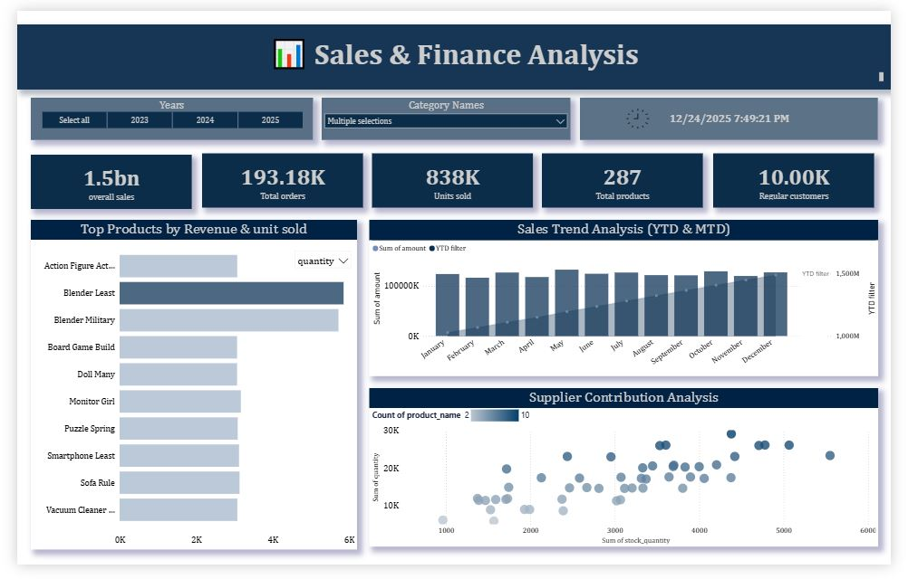
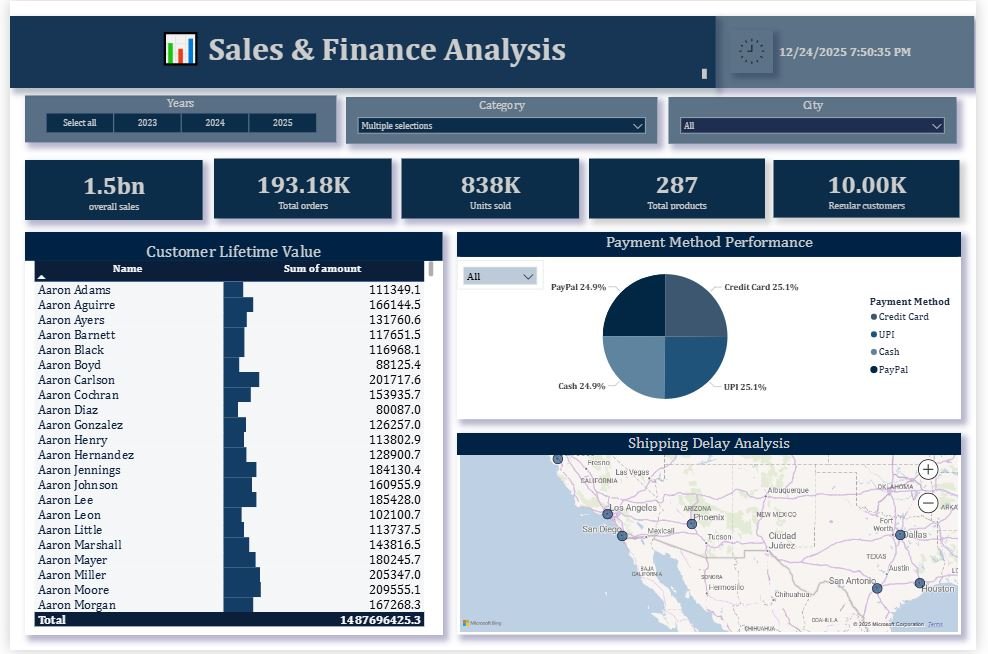

# Sales & Finance Analysis Dashboard | Power BI

## Project Overview
This project focuses on analyzing sales and financial performance using Power BI. 
The goal of this dashboard is to help businesses understand revenue trends, product performance, and supplier contribution through interactive data visualizations.

The dashboard transforms raw sales data into meaningful insights that support better business decision-making.

---

## Objectives
The key objectives of this project were:

- Analyze overall sales performance
- Identify top-performing products
- Track revenue trends across different months
- Understand supplier contribution to revenue
- Visualize business performance using interactive dashboards

---

## Tools & Technologies Used
- Power BI
- Microsoft Excel
- Data Cleaning
- Data Modeling
- Data Visualization

---

## Dataset
The dataset used in this project contains information related to:

- Product details
- Sales transactions
- Supplier information
- Revenue and quantity sold

The data was cleaned and transformed before building the dashboard.

---

## Dashboard Features
The dashboard includes the following insights:

- Total Sales Revenue
- Total Orders
- Units Sold
- Monthly Sales Trend
- Top Products by Revenue
- Supplier Contribution Analysis

These visualizations help understand how products and suppliers impact overall sales performance.

---

## Dashboard Preview

### Sales Overview

### Finance Analysis

---

## Key Insights
- Identified top revenue-generating products
- Analyzed monthly sales trends
- Observed supplier contribution to overall revenue
- Visualized business performance metrics for decision making

---

## Skills Demonstrated
- Data Analysis
- Business Intelligence
- Data Visualization
- Dashboard Development
- Data Cleaning

---

## Author
Neha Dhumal  
Aspiring Data Analyst
